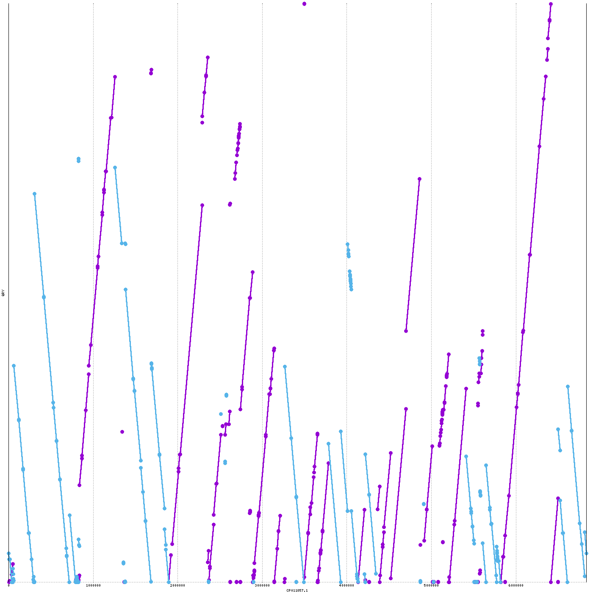

# Pseudomonas Genome Alignment Project

> **Compare the genomes of Pseudomonas aeruginosa ATCC 27853 and ST235 with quick and dirty but reproducible steps and a dotplot visualization gene.**

---

Downloading, aligning, and visualizing the genomes of two Pseudomonas aeruginosa strains using MUMmer, with special focus on identifying and highlighting the VIM gene (blaVIM-2) that is unique to ST235.

---

### 🛠️ Prerequisites

#### 📦 Install Required Tools
```bash
sudo apt-get update
sudo apt-get install mummer gnuplot ncbi-blast+
```


###  1. Download Genome FASTA Files
# Download ATCC 27853 genome
ATCC.fasta "https://www.ncbi.nlm.nih.gov/datasets/genome/GCA_001687285.1/"

# Download ST235 genome  
ST.fasta "https://www.ncbi.nlm.nih.gov/datasets/genome/GCA_016923535.1/"

```bash
# Download VIM gene (blaVIM-2) for analysis
curl -L 'https://www.ncbi.nlm.nih.gov/nuccore/GU137304.1?report=fasta&format=text' -o blaVIM2.fasta
```


###  2. Align Genomes with MUMmer
```bash
nucmer --prefix=ATCC_vs_ST ATCC.fasta ST.fasta
delta-filter -1 ATCC_vs_ST.delta > ATCC_vs_ST.filtered.delta
show-coords -rcl ATCC_vs_ST.filtered.delta > ATCC_vs_ST.coords
```


###  3. Search for VIM Gene
```bash
# Create BLAST databases
makeblastdb -in ATCC.fasta -dbtype nucl
makeblastdb -in ST.fasta -dbtype nucl

# Search for VIM gene in both genomes
blastn -query blaVIM2.fasta -db ATCC.fasta -out VIM_in_ATCC.txt -outfmt 6
blastn -query blaVIM2.fasta -db ST.fasta -out VIM_in_ST.txt -outfmt 6

# Check results
echo "VIM gene hits in ATCC:"
wc -l VIM_in_ATCC.txt
echo "VIM gene hits in ST235:"
wc -l VIM_in_ST.txt
```


###  4. Summarize Alignment
```bash
awk 'NR>5 {aligned+=$7; refcov+=$11; querycov+=$12; blocks++} END {print "Total aligned bases:", aligned; print "Alignment blocks:", blocks; print "Avg % identity:", "see below"}' ATCC_vs_ST.coords
awk 'NR>5 {id+=$8*$7; len+=$7} END {if(len>0) print "Weighted avg % identity:", id/len; else print "No alignments"}' ATCC_vs_ST.coords
```


###  5. Generate Basic Dotplot
```bash
mummerplot --png --large --layout --filter --prefix=ATCC_vs_ST_plot ATCC_vs_ST.filtered.delta
# Fix gnuplot error if it occurs
sed -i '/set mouse clipboardformat/d' ATCC_vs_ST_plot.gp
gnuplot ATCC_vs_ST_plot.gp
```


###  6. Create Enhanced Dotplot with VIM Gene Highlight
```bash
# Add VIM gene annotation and styling to the gnuplot script
cat >> ATCC_vs_ST_plot.gp << 'EOF'

# Clear legend and annotations
set key at graph 0.02, graph 0.98 left font "Arial,12"

# Add red arrow pointing to VIM gene location
set arrow 1 from graph 0.9, first 7074888 to graph 0.95, first 7074888 lc rgb "red" lw 3 head filled
set label 1 "VIM gene" at graph 0.85, first 7074888 center tc rgb "red" font "Arial,12,bold"

# Add grey dots for unique regions
set object 2 circle at graph 0.99, first 7072697 size graph 0.005 fc rgb "#808080" fillstyle solid noborder
set object 3 circle at first 50000, graph 0.005 size graph 0.005 fc rgb "#808080" fillstyle solid noborder
set object 4 circle at first 650000, graph 0.005 size graph 0.005 fc rgb "#808080" fillstyle solid noborder
set object 5 circle at first 1250000, graph 0.005 size graph 0.005 fc rgb "#808080" fillstyle solid noborder

# Add title and better axis labels
set title "Genome Alignment: ATCC 27853 vs ST235\nCyan=Forward alignments, Purple=Reverse alignments, Red=VIM gene, Grey=Unique regions" font "Arial,14,bold"
set xlabel "ATCC 27853 genome position" font "Arial,12"
set ylabel "ST235 genome position" font "Arial,12"
EOF

# Regenerate the enhanced plot
gnuplot ATCC_vs_ST_plot.gp
```


###  Results Summary
| Metric                      | Value         |
|-----------------------------|--------------|
| **Total aligned bases**     | 6,123,079    |
| **Alignment blocks**        | 298          |
| **Weighted avg % identity** | >98%         |
| **VIM gene in ATCC**        | Not found    |
| **VIM gene in ST235**       | Found (contig JAFFXY010000040.1) |

**Key Findings:**

#### 🖼️ Enhanced Alignment Dotplot
<p align="center">
  
</p>

**Plot Legend:**


## 📚 References & Further Info


## 🧑‍🔬 Legacy/Alternative Data & Methods

### Status
  - ATCC 27853 complete genome: CP015117.1 → `ATCC_27853_CP015117.1.fasta` ([NCBI](https://www.ncbi.nlm.nih.gov/nuccore/CP015117.1))
  - ATCC 27853 alternative genome: CP011857.1 → `ATCC_27853_alternative.fasta` ([NCBI](https://www.ncbi.nlm.nih.gov/nuccore/CP011857.1)) - from PMC5467263
  - ST235 representative complete genome (NCGM2.S1): AP012280.1 → `ST235_NCGM2S1_AP012280.1.fasta` ([NCBI](https://www.ncbi.nlm.nih.gov/nuccore/AP012280.1))
  - Note: Urbanowicz et al., 2021 link `LFMO00000000` is a WGS master and contains no sequence data ([NCBI](https://www.ncbi.nlm.nih.gov/nuccore/LFMO00000000))
  ```bash
  # Download ATCC 27853 genome (CP015117.1)
  wget -O ATCC_27853_CP015117.1.fasta "https://www.ncbi.nlm.nih.gov/sviewer/viewer.cgi?tool=portal&save=file&log$=seqview&db=nuccore&report=fasta&id=CP015117.1"
  
  # Download ATCC 27853 alternative genome (CP011857.1) from PMC5467263
  wget -O ATCC_27853_alternative.fasta "https://www.ncbi.nlm.nih.gov/sviewer/viewer.cgi?tool=portal&save=file&log$=seqview&db=nuccore&report=fasta&id=CP011857.1"
  
  # Download ST235 genome (NCGM2.S1)
  wget -O ST235_NCGM2S1_AP012280.1.fasta "https://www.ncbi.nlm.nih.gov/sviewer/viewer.cgi?tool=portal&save=file&log$=seqview&db=nuccore&report=fasta&id=AP012280.1"
  
  # Download and extract minimap2
  wget -O minimap2-2.28_x64-linux.tar.bz2 https://github.com/lh3/minimap2/releases/download/v2.28/minimap2-2.28_x64-linux.tar.bz2
  tar -xjf minimap2-2.28_x64-linux.tar.bz2
  
  # Run genome alignment (CP015117.1 vs ST235)
  ./minimap2-2.28_x64-linux/minimap2 -x asm5 -t 4 ATCC_27853_CP015117.1.fasta ST235_NCGM2S1_AP012280.1.fasta > ATCC27853_vs_ST235_NCGM2S1.paf
  
  # Run genome alignment (CP011857.1 vs ST235)
  ./minimap2-2.28_x64-linux/minimap2 -x asm5 -t 4 ATCC_27853_alternative.fasta ST235_NCGM2S1_AP012280.1.fasta > ATCC27853_CP011857_vs_ST235_NCGM2S1.paf
  
  # Quick summary statistics
  awk 'BEGIN{m=0;b=0;ql=0;tl=0} {m+=$10; b+=$11; if($2>ql) ql=$2; if($7>tl) tl=$7} END{printf "matches=%d aln_bases=%d qlen=%d tlen=%d pid=%.6f\n",m,b,ql,tl,m/b}' ATCC27853_vs_ST235_NCGM2S1.paf
  awk 'BEGIN{m=0;b=0;ql=0;tl=0} {m+=$10; b+=$11; if($2>ql) ql=$2; if($7>tl) tl=$7} END{printf "matches=%d aln_bases=%d qlen=%d tlen=%d pid=%.6f\n",m,b,ql,tl,m/b}' ATCC27853_CP011857_vs_ST235_NCGM2S1.paf
  ```
  - Tool: `minimap2` (v2.28) with `-x asm5`
  - Output files: 
    - `ATCC27853_vs_ST235_NCGM2S1.paf` (CP015117.1 vs ST235)
    - `ATCC27853_CP011857_vs_ST235_NCGM2S1.paf` (CP011857.1 vs ST235)
  - Quick summary (PAF aggregate):
    - CP015117.1 vs ST235: matches = 5,143,335; aligned bases = 7,093,386; rough pid = 0.725
    - CP011857.1 vs ST235: matches = 5,141,970; aligned bases = 7,146,480; rough pid = 0.720
  - If available, provide the exact ST235 accession from Urbanowicz et al., 2021 to replace the representative genome and re-run.
  - Compute robust ANI and SNP/indel stats (e.g., `dnadiff`/`fastANI`) and generate a brief report.
 
  ### Plot sanitization (headless rendering)

  Some gnuplot scripts produced by the plot generator include interactive commands (mouse/clipboard handlers, `print` banners and `pause -1`) which force gnuplot into interactive mode and prevent headless PNG generation. To run the plots on a headless machine or inside scripts, the following conservative changes were applied to problematic `.gp` files in this repo:

  - Removed interactive lines:
    - any lines beginning with `set mouse ...`
    - `print` lines that show an interactive banner
    - `pause -1`
  - Ensured non-interactive output by adding (when needed):
    - `set terminal pngcairo size 1600,1200 enhanced font "Courier,8"`
    - `set output '/full/path/to/<name>.png'` (absolute path) before plotting commands

  Files already sanitized in this repo:
  - `pa_comparison.gp` → `pa_comparison.png`
  - `pa_comparison.relaxed.gp` → `pa_comparison.relaxed.png`

  How to re-run the sanitized plots
  - From the project root run:

  ```bash
  cd /home/ash022/pseudomonas_align_strains
  gnuplot pa_comparison.gp
  gnuplot pa_comparison.relaxed.gp
  gnuplot pa_comparison.rects.gp
  ```

  Quick check (verify output):

  ```bash
  ls -l pa_comparison*.png
  # Expect non-zero-sized PNG files: pa_comparison.png, pa_comparison.relaxed.png, pa_comparison.rects.png
  ```

  Optional: small helper to sanitize other `.gp` files
  - Save this as `scripts/sanitize_gp.sh`, make it executable, then run it on any `.gp` files you need to sanitize.

  ```bash
  mkdir -p scripts
  cat > scripts/sanitize_gp.sh <<'EOF'
  #!/usr/bin/env bash
  set -euo pipefail
  for f in "$@"; do
    echo "Sanitizing: $f"
    # remove interactive lines that break headless rendering
    sed -i '/^set mouse/d;/^print /d;/^pause -1/d' "$f"

    # ensure a pngcairo terminal is present
    if ! grep -q '^set terminal' "$f"; then
      sed -i '1i set terminal pngcairo size 1600,1200 enhanced font "Courier,8"' "$f"
    fi

    # ensure an absolute output line is present
    if ! grep -q '^set output' "$f"; then
      out="$(pwd)/${f%.gp}.png"
      sed -i "1i set output '$out'" "$f"
    fi
  done
  EOF
  chmod +x scripts/sanitize_gp.sh

  # Usage example:
  # scripts/sanitize_gp.sh pa_comparison.gp pa_comparison.relaxed.gp other_plot.gp
  ```

### Export high-resolution figures (SVG / PDF)

The plots generated by `mummerplot`/`gnuplot` can be exported as publication-ready SVG or PDF files by adjusting the gnuplot terminal and re-running the script. Example steps I used in this project:

1. Make an SVG copy of a generated `.gp` and set a high-resolution terminal and output:

```bash
cp pa_comparison.relaxed.gp pa_comparison.relaxed.svg.gp
sed -i "s#^set terminal.*#set terminal svg size 2000,1200#" pa_comparison.relaxed.svg.gp
sed -i "s#^set output.*#set output 'pa_comparison.relaxed.svg'#" pa_comparison.relaxed.svg.gp
gnuplot pa_comparison.relaxed.svg.gp
```

2. Make a PDF copy using `pdfcairo`:

```bash
cp pa_comparison.relaxed.gp pa_comparison.relaxed.pdf.gp
sed -i "s#^set terminal.*#set terminal pdfcairo size 11in,8in enhanced font 'Arial,12'#" pa_comparison.relaxed.pdf.gp
sed -i "s#^set output.*#set output 'pa_comparison.relaxed.pdf'#" pa_comparison.relaxed.pdf.gp
gnuplot pa_comparison.relaxed.pdf.gp
```

Files produced in this run (added to the repository):

- `pa_comparison.relaxed.svg` — high-resolution SVG of the relaxed plot
- `pa_comparison.relaxed.pdf` — PDF export of the relaxed plot
- `pa_comparison.rects.svg` / `pa_comparison.rects.pdf` — precise-rectangles plot (SVG + PDF)
- `pa_comparison.annotated3.svg` / `pa_comparison.annotated3.pdf` — annotated version (SVG + PDF)

Notes:
- These copies preserve the original `.gp` script; we create `.svg.gp` / `.pdf.gp` variants so the original scripts remain unchanged.
- SVG is preferred for vector editing and publication; PDF via `pdfcairo` is suitable for inclusion in manuscripts.


## Reproducible pipeline — commands and helper scripts

Below are concrete commands and the small helper scripts used during this analysis so you can reproduce the pipeline from Bakta TSVs to grouped summaries and a proportional Venn diagram.

Prereqs (system packages)
```bash
# required system tools used in this repo
sudo apt-get update
sudo apt-get install -y mummer gnuplot ncbi-blast+ python3-pip
```

Prereqs (python packages)
```bash
# install plotting and venn library into the same python used here
python3 -m pip install --user matplotlib matplotlib-venn
```

Assumptions
- Input annotation TSVs are `ATCC.tsv` and `ST.tsv` (Bakta output TSVs). If you don't have them, run Bakta or Prokka first to create those files.

1) Group each Bakta TSV by the raw `Product` string and add a `Matches` count

Save this as `scripts/group_by_product_with_counts.py` and run it.

```python
#!/usr/bin/env python3
from pathlib import Path
from collections import defaultdict

def group_by_product(inpath, outpath):
    p = Path(inpath)
    text = p.read_text(encoding='utf-8', errors='surrogateescape').splitlines()
    header_line = None
    for i, l in enumerate(text[:10]):
        if l.startswith('#') and 'Sequence' in l:
            header_line = l.lstrip('#')
            start = i
            break
    if header_line is None:
        header_line = text[0]
        start = 0
    fieldnames = [f.strip() for f in header_line.split('\t')]
    rows = []
    for l in text[start+1:]:
        if not l.strip():
            continue
        parts = l.split('\t')
        if len(parts) < len(fieldnames):
            parts += [''] * (len(fieldnames) - len(parts))
        row = dict(zip(fieldnames, parts))
        rows.append(row)
    groups = defaultdict(list)
    for r in rows:
        prod = r.get('Product','')
        groups[prod].append(r)
    out_header = ['Product','Matches'] + [c for c in fieldnames if c!='Product']
    out_lines = []
    for prod, items in sorted(groups.items(), key=lambda x: (-len(x[1]), x[0])):
        matches = len(items)
        agg = {}
        for col in fieldnames:
            vals = []
            for it in items:
                v = it.get(col,'')
                if v and v not in vals:
                    vals.append(v)
            agg[col] = ';'.join(vals)
        rowout = [prod, str(matches)] + [agg[c] for c in fieldnames if c!='Product']
        out_lines.append('\t'.join(rowout))
    outp = Path(outpath)
    outp.parent.mkdir(parents=True, exist_ok=True)
    with outp.open('w', encoding='utf-8') as fh:
        fh.write('\t'.join(out_header) + '\n')
        for l in out_lines:
            fh.write(l + '\n')

if __name__ == '__main__':
    group_by_product('ATCC.tsv','ATCC_grouped_by_product_with_counts.tsv')
    group_by_product('ST.tsv','ST_grouped_by_product_with_counts.tsv')
```

Run:
```bash
python3 scripts/group_by_product_with_counts.py
```

2) Merge the two grouped files keeping per-file counts and a `Total_Matches` column

Save this as `scripts/merge_grouped_with_counts.py`.

```python
#!/usr/bin/env python3
from pathlib import Path

def read_grouped(path):
    text = Path(path).read_text(encoding='utf-8', errors='surrogateescape').splitlines()
    header = text[0].split('\t')
    rows = {}
    for ln in text[1:]:
        if not ln.strip():
            continue
        parts = ln.split('\t')
        if len(parts) < len(header):
            parts += [''] * (len(header)-len(parts))
        d = dict(zip(header, parts))
        prod = d.get('Product','')
        rows[prod] = {'Matches': int(d.get('Matches','0') or 0), 'data': d}
    return header, rows

ha, ra = read_grouped('ATCC_grouped_by_product_with_counts.tsv')
hs, rs = read_grouped('ST_grouped_by_product_with_counts.tsv')
cols_a = [c for c in ha if c not in ('Product','Matches')]
cols_s = [c for c in hs if c not in ('Product','Matches')]
all_products = sorted(set(list(ra.keys()) + list(rs.keys())))
outcols = ['Product','ATCC_Matches','ST_Matches','Total_Matches'] + [f'ATCC_{c}' for c in cols_a] + [f'ST_{c}' for c in cols_s]
with open('combined_grouped_with_counts.tsv','w',encoding='utf-8') as fh:
    fh.write('\t'.join(outcols) + '\n')
    for prod in all_products:
        a = ra.get(prod)
        s = rs.get(prod)
        a_matches = a['Matches'] if a else 0
        s_matches = s['Matches'] if s else 0
        total = a_matches + s_matches
        row = [prod, str(a_matches), str(s_matches), str(total)]
        for c in cols_a:
            row.append(a['data'].get(c,'') if a else '')
        for c in cols_s:
            row.append(s['data'].get(c,'') if s else '')
        fh.write('\t'.join(row) + '\n')
```

Run:
```bash
python3 scripts/merge_grouped_with_counts.py
```

3) Mark source (ATCC_only / ST_only / both)

Save as `scripts/mark_sources.py`:

```python
#!/usr/bin/env python3
from pathlib import Path
lines = Path('combined_grouped_with_counts.tsv').read_text(encoding='utf-8', errors='surrogateescape').splitlines()
header = lines[0].split('\t')
with open('combined_grouped_with_counts_marked.tsv','w',encoding='utf-8') as fh:
    fh.write('\t'.join(header + ['Source']) + '\n')
    for ln in lines[1:]:
        if not ln.strip():
            continue
        parts = ln.split('\t')
        row = dict(zip(header, parts))
        a = int(row.get('ATCC_Matches','0') or 0)
        s = int(row.get('ST_Matches','0') or 0)
        if a>0 and s>0:
            src='both'
        elif a>0:
            src='ATCC_only'
        elif s>0:
            src='ST_only'
        else:
            src='none'
        fh.write('\t'.join(parts + [src]) + '\n')
```

Run:
```bash
python3 scripts/mark_sources.py
```

4) Proportional two-set Venn (matplotlib-venn)

Save as `scripts/venn_proportional.py`:

```python
#!/usr/bin/env python3
from pathlib import Path
from matplotlib_venn import venn2
import matplotlib
matplotlib.use('Agg')
import matplotlib.pyplot as plt

lines = Path('combined_grouped_with_counts_marked.tsv').read_text(encoding='utf-8', errors='surrogateescape').splitlines()
header = lines[0].split('\t')
src_idx = header.index('Source')
counts = {'ATCC_only':0,'ST_only':0,'both':0}
for ln in lines[1:]:
    if not ln.strip():
        continue
    parts = ln.split('\t')
    src = parts[src_idx]
    if src in counts:
        counts[src]+=1
set1 = counts['ATCC_only'] + counts['both']
set2 = counts['ST_only'] + counts['both']
inter = counts['both']
plt.figure(figsize=(6,6))
venn = venn2(subsets=(set1-inter, set2-inter, inter), set_labels=('ATCC','ST'))
if venn.get_label_by_id('10'):
    venn.get_label_by_id('10').set_text(str(counts['ATCC_only']))
if venn.get_label_by_id('01'):
    venn.get_label_by_id('01').set_text(str(counts['ST_only']))
if venn.get_label_by_id('11'):
    venn.get_label_by_id('11').set_text(str(counts['both']))
plt.title('Product overlap: ATCC vs ST')
plt.savefig('venn_proportional_ATCC_ST.png', dpi=200, bbox_inches='tight')
```

Run:
```bash
python3 scripts/venn_proportional.py
```

Files created by the reproducible pipeline (names used above)
- `ATCC_grouped_by_product_with_counts.tsv`
- `ST_grouped_by_product_with_counts.tsv`
- `combined_grouped_with_counts.tsv`
- `combined_grouped_with_counts_marked.tsv`
- `venn_proportional_ATCC_ST.png` (proportional Venn diagram)

If you want, I can add and commit these helper scripts into the repository under `scripts/` now. Reply "yes, commit scripts" to have me create the `scripts/` folder and add these files to git.

## Bakta installation & annotation (how I ran it)

The genome annotation step in this project used Bakta. Below are the concrete commands I used so you can reproduce the annotation locally.

Prereqs (recommended)
```bash
# optional: create an isolated conda env (recommended)
conda create -n bakta python=3.10 -y
conda activate bakta

# or use your system Python/pip
python3 -m pip install --user pipx || true
```

Install Bakta
```bash
# using pip inside the active environment
python3 -m pip install --upgrade pip
python3 -m pip install bakta

# confirm version
bakta --version
# expected output (example): bakta 1.11.3
```

Obtain a Bakta DB bundle

- I used a lightweight DB bundle (named `db-light.tar.xz` in my run). If you have a supplied archive use it; otherwise download the appropriate Bakta DB from the Bakta release or provider.

```bash
# create a folder for the DB and extract the bundle
mkdir -p bakta_db
# path/to/db-light.tar.xz may be a local path or downloaded file
tar -xJf /path/to/db-light.tar.xz -C bakta_db
```

Run Bakta annotation (examples used in this repository)
```bash
# annotate ATCC
bakta annotate \
  --db-dir bakta_db \
  --output bakta_ATCC \
  --prefix ATCC \
  ATCC.fasta

# annotate ST
bakta annotate \
  --db-dir bakta_db \
  --output bakta_ST \
  --prefix ST \
  ST.fasta
```

Outputs
- Annotation directories: `bakta_ATCC/`, `bakta_ST/`
- Main TSVs used downstream: `ATCC.tsv` and `ST.tsv` (extracted from the Bakta outputs)

Troubleshooting notes
- If Bakta (or one of its bundled AMR binaries) fails with C++ runtime errors (missing GLIBCXX symbols), use a Conda environment with a current toolchain or update the environment's `libstdc++`/`gcc` packages. For example:
```bash
conda install -n bakta libgcc-ng libstdcxx-ng -y
```
- If you have a custom DB bundle, pass its directory with `--db-dir` as shown above.

If you want, I can add the exact `bakta` command-lines that were run (including any extra flags) into the repository's run-log; tell me if you'd like them appended.

### Exact commands I ran for Bakta in this project

The following are the exact shell commands used during this session to set up Bakta, install the DB bundle provided to me, fix the AMR runtime libraries, run annotation, and copy the produced TSVs into the repository root.

```bash
# create & enter conda env (optional but recommended)
conda create -n bakta python=3.10 -y
conda activate bakta

# install bakta
python3 -m pip install --upgrade pip
python3 -m pip install bakta

# extract the user-supplied Bakta DB bundle used in this run
mkdir -p bakta_db
# (path used in this session)
# replace the path below with your DB archive path if different
tar -xJf /mnt/z/Download/db-light.tar.xz -C bakta_db

# fix runtime libs for bundled AMR binary (if you see GLIBCXX errors)
conda install -n bakta libgcc-ng libstdcxx-ng -y

# Run Bakta annotation (commands used here)
bakta annotate --db-dir bakta_db --output bakta_ATCC --prefix ATCC ATCC.fasta
bakta annotate --db-dir bakta_db --output bakta_ST --prefix ST ST.fasta

# Copy or move main TSV outputs into repo root for downstream scripts
# (Bakta writes TSVs into its output directory; copy them here)
cp bakta_ATCC/ATCC.tsv ./ATCC.tsv
cp bakta_ST/ST.tsv ./ST.tsv
```

These exact commands should reproduce the annotation step performed for `ATCC.fasta` and `ST.fasta` in this project. If your DB archive or paths differ, update the `tar -xJf` command and `--db-dir` accordingly.

